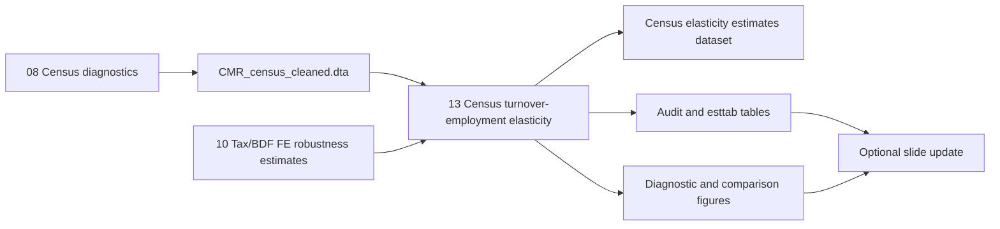

# Census Turnover-Employment Elasticity Robustness Check

## Overview

Implement Task 1.2 from `tasks/Meeting 06-11-2026.md`: estimate Census/RGE cross-sectional annual-turnover/employment elasticities as a robustness and coverage check against the existing Cameroon administrative tax/BDF employment elasticities.

The Census data do not have panel time variation. The implementation should therefore not try to recreate firm fixed effects, year fixed effects, or NACAM-by-year fixed effects from the tax/BDF panel. Instead, it should produce transparent cross-sectional log-log associations using headquarters Census firms, with fixed effects limited to cross-sectional sector intercepts that are identified in one year.

## Problem Frame

The current main Cameroon elasticity estimates use the administrative tax/BDF panel and estimate sector-specific employment elasticities with respect to value added and total revenue. Those estimates rely on firm-year variation and can include firm fixed effects plus time-shock controls such as NACAM-by-year effects.

The Census/RGE source is broader but cross-sectional. It already contributes sector diagnostics through `code/elasticity_cameroun/08_cmr_census_sector_diagnostics.do`, which writes `Data/Analysis/CMR_census_cleaned.dta` with cleaned headquarters employment, annual turnover, harmonized NACAM sectors, source provenance, and audit flags. The new task should reuse that cleaned file and estimate comparable turnover-employment slopes without overstating identification.

## Requirements Trace

- R1. Reuse the existing Census/RGE cleaning and NACAM crosswalk rather than re-importing or manually editing the raw workbook.
- R2. Treat the primary estimate as employment elasticity with respect to annual turnover: `ln(employment)` on `ln(annual_turnover)`, because that matches the existing tax/BDF employment-on-revenue interpretation.
- R3. Make the absence of time variation explicit: no firm FE, no year FE, and no sector-year FE in the Census robustness check.
- R4. Include only defensible cross-sectional fixed effects: detailed NACAM sector intercepts for common-slope models, and sector-specific slopes via turnover-by-sector interactions where support allows.
- R5. Export generated `esttab`/`estout` LaTeX tables, audit tables, Stata datasets, and PNG/PDF figures from code.
- R6. Compare Census annual-turnover elasticities with existing administrative/BDF total-revenue elasticities where sector definitions overlap, while labeling the comparison as descriptive rather than causal.
- R7. Keep sample restrictions auditable: positive employment, positive annual turnover, headquarters rows, mapped sector, support thresholds, zero/missing/nonpositive counts, and review-flag counts.

## Scope Boundaries

- Do not estimate annual-turnover elasticity with respect to employment as the main result. That reverse direction can be a sensitivity only if explicitly useful, because it changes the interpretation from the current tax/BDF elasticity.
- Do not add controls from the raw Census workbook unless those variables are first pulled into the cleaned Census stage with provenance and missingness audits.
- Do not use sector-year, firm, or panel fixed effects in the Census specification.
- Do not hand-edit exported LaTeX tables or figures.
- Do not use the blocked Census asset field; Task 1.1 remains separately documented as blocked for Census assets.

## Context & Research

### Relevant Code and Patterns

- `code/elasticity_cameroun/08_cmr_census_sector_diagnostics.do` imports the Census workbook, keeps `S6Q05AC` as employment and `S6Q01A` as annual turnover, restricts those fields to headquarters rows, merges the reviewable NACAM crosswalk, writes `Data/Analysis/CMR_census_cleaned.dta`, and exports Census diagnostic figures.
- `docs/cmr_census_cleaning_process.md` documents the Census cleaning assumptions and current audit counts: 438,893 raw rows, 430,011 headquarters rows, and 430,011 headquarters rows used in Census NACAM plots.
- `docs/cmr_census_crosswalk_note.tex` documents the activity-to-NACAM crosswalk and the limitation that Census activity labels are mapped through reviewable crosswalk workbooks.
- `code/elasticity_cameroun/06_cmr_nacam_elasticity.do` is the main tax/BDF elasticity pattern: build logs, define samples, require support thresholds, estimate sector-specific slopes through `c.log_output##i.nacam`, recover implied sector elasticities with `lincom`, and export tables/figures.
- `code/elasticity_cameroun/10_cmr_fe_robustness_plots.do` writes `Data/Analysis/cmr_nacam_fe_robustness_estimates.dta`, which is the cleanest existing Stata dataset for comparing administrative total-revenue elasticities with the Census estimates.
- `code/00_master.do` currently runs setup, BDF cleaning, BDF asset diagnostics, and Census diagnostics. It should orchestrate the new Census elasticity stage after the Census cleaned file is produced and after any administrative comparison source it depends on.

### Institutional Learnings

- No `docs/solutions/` directory was present during planning.
- `SESSIONS.md` shows a consistent repo convention: new analysis stages should produce auditable datasets, tables, figures, and concise session-memory entries; figures and tables should be generated from Stata; outputs should be presentation-ready but cautious about causal interpretation.

### External References

- None used. The local Stata patterns are sufficient, and the key question is project-specific identification and data structure rather than an external library/API decision.

## Key Technical Decisions

- Primary estimand: employment elasticity with respect to annual turnover. This preserves the existing tax/BDF interpretation of employment response to output/revenue scale.
- Primary sample: headquarters Census rows with positive employment, positive annual turnover, nonmissing admin-overlap `nacam`, and nonmissing labels. This maximizes comparability with tax/BDF sector elasticities.
- Whole-Census sector sensitivity: optionally repeat descriptive/common-slope outputs using `census_nacam` to include Census sectors outside the administrative elasticity panel, but keep tax/BDF comparison on admin-overlap `nacam`.
- Fixed effects: use cross-sectional sector intercepts only. The common-slope baseline should include detailed NACAM FE. The sector-specific model should use `c.ln_annual_turnover##i.nacam`, which includes sector intercepts and sector-specific slopes in one cross-section.
- Standard errors: use robust firm-level heteroskedasticity-robust standard errors. Do not cluster by firm because there is only one Census observation per firm. Avoid cluster-by-sector as the default because sector-specific slopes leave too few meaningful clusters for inference.
- Support thresholds: start from the current tax/BDF thresholds where possible, requiring at least 30 positive-turnover/employment Census firms per sector and nonzero variation in log turnover and log employment before reporting sector-specific slopes.
- Comparison source: use `Data/Analysis/cmr_nacam_fe_robustness_estimates.dta` for administrative total-revenue baseline estimates if the comparison stage is implemented. Ensure `code/00_master.do` runs `10_cmr_fe_robustness_plots.do` before the new stage, or make the comparison gracefully fail with a clear message if that dataset is unavailable.

## Open Questions

### Resolved During Planning

- Should the main direction be employment on annual turnover? Yes. This aligns with the existing tax/BDF employment elasticity estimates.
- What fixed effects are defensible in a Census cross-section? Sector intercepts only: detailed NACAM FE or broad `data_export` FE. Firm FE, year FE, and sector-year FE are not identified.
- Should the implementation reuse the raw Census workbook directly? No. It should consume `Data/Analysis/CMR_census_cleaned.dta` produced by `08_cmr_census_sector_diagnostics.do`.

### Deferred to Implementation

- Exact final support threshold after inspecting the positive-turnover sample by sector: begin with 30 firms per sector, but confirm that this does not produce empty or unstable comparison plots.
- Whether a reverse-direction sensitivity table is worth exporting: add only if the main model runs cleanly and the output does not confuse the interpretation.
- Whether the slide deck should include the Census coefficient plot, the Census-vs-BDF scatter, or only a compact robustness table: decide after seeing legibility and coefficient stability.

## High-Level Technical Design

> *This illustrates the intended approach and is directional guidance for review, not implementation specification. The implementing agent should treat it as context, not code to reproduce.*

## Implementation Units

- [ ] **Unit 1: Add Census Elasticity Stage**

**Goal:** Create a standalone Stata stage that estimates Census/RGE turnover-employment elasticities from the cleaned firm-level Census file.

**Requirements:** R1, R2, R3, R4, R5, R7

**Dependencies:** `code/elasticity_cameroun/08_cmr_census_sector_diagnostics.do` must run first.

**Files:**
- Create: `code/elasticity_cameroun/13_cmr_census_turnover_employment_elasticity.do`
- Read: `Data/Analysis/CMR_census_cleaned.dta`
- Create: `Data/Analysis/cmr_census_turnover_employment_elasticity.dta`
- Create: `output/tables/cmr_census_turnover_employment_elasticity.tex`
- Create: `output/tables/cmr_census_turnover_employment_elasticity_audit.tex`
- Create: `output/figures/cmr_census_turnover_employment_elasticity_coefficients.{pdf,png}`
- Create: `output/figures/cmr_census_turnover_employment_elasticity_scatter.{pdf,png}`

**Approach:**
- Bootstrap paths with the same local-root pattern used in `08`, `10`, and `11`.
- Load `Data/Analysis/CMR_census_cleaned.dta`.
- Keep the firm-level variables needed for estimation: `firmid_census`, `hq_sample`, `employment`, `annual_turnover`, `nacam`, `census_nacam`, labels, `data_export`, `review_flag`, and raw audit flags where useful.
- Define `ln_emp` and `ln_annual_turnover` only for positive values.
- Export an audit matrix through `esttab` showing raw cleaned rows, headquarters rows, positive-employment rows, positive-turnover rows, common positive sample, mapped admin-overlap sectors, review-flagged rows, nonpositive exclusions, and sector support counts.
- Estimate a common-slope model with detailed NACAM sector FE.
- Estimate sector-specific slopes using turnover-by-NACAM interactions and recover implied sector slopes with `lincom`, following the pattern in `06_cmr_nacam_elasticity.do`.
- Suppress or flag sectors below support thresholds rather than silently dropping them without an audit.

**Patterns to follow:**
- `code/elasticity_cameroun/06_cmr_nacam_elasticity.do` for log construction, sector support, `lincom` extraction, matrix exports, and coefficient plots.
- `code/elasticity_cameroun/08_cmr_census_sector_diagnostics.do` for Census labels, broad sector color/shape vocabulary, and audit style.
- `code/elasticity_cameroun/10_cmr_fe_robustness_plots.do` for compact check-only outputs and robustness language.

**Test scenarios:**
- Happy path: with current `CMR_census_cleaned.dta`, the stage writes the estimate dataset, audit table, elasticity table, and both figure formats.
- Happy path: the common-slope model includes sector intercepts and reports the expected positive-employment/positive-turnover sample count.
- Happy path: the sector-specific table includes only sectors meeting support thresholds and contains nonmissing elasticity, standard error, confidence interval, firm count, and observation count fields.
- Edge case: sectors with fewer than the minimum positive firms remain visible in an audit output with a suppression reason.
- Edge case: zero or missing annual turnover and employment observations are excluded from log models but counted in the audit table.
- Error path: if `Data/Analysis/CMR_census_cleaned.dta` is missing, the do-file fails loudly and tells the user to run `08_cmr_census_sector_diagnostics.do`.
- Integration: output sector labels match the current NACAM display labels used by Census diagnostics and administrative elasticity figures.

**Verification:**
- The Stata log closes cleanly.
- `Data/Analysis/cmr_census_turnover_employment_elasticity.dta` has unique `nacam` rows for reported sector-specific estimates.
- The audit table reconciles the estimation sample from cleaned Census rows to reported sectors.
- PNG figures are legible and do not contain stale sector labels.

- [ ] **Unit 2: Add Administrative Comparison Output**

**Goal:** Compare Census annual-turnover elasticities against administrative tax/BDF total-revenue employment elasticities for overlapping NACAM sectors.

**Requirements:** R5, R6, R7

**Dependencies:** Unit 1 and `Data/Analysis/cmr_nacam_fe_robustness_estimates.dta` from `code/elasticity_cameroun/10_cmr_fe_robustness_plots.do`.

**Files:**
- Modify: `code/elasticity_cameroun/13_cmr_census_turnover_employment_elasticity.do`
- Read: `Data/Analysis/cmr_nacam_fe_robustness_estimates.dta`
- Create: `Data/Analysis/cmr_census_vs_bdf_turnover_employment_elasticity.dta`
- Create: `output/tables/cmr_census_vs_bdf_turnover_employment_elasticity.tex`
- Create: `output/figures/cmr_census_vs_bdf_turnover_employment_elasticity.{pdf,png}`

**Approach:**
- Keep only the administrative `outcome == "tot_rev"` and baseline FE specification from the FE robustness estimates.
- Merge Census sector estimates to administrative estimates by `nacam`.
- Export a comparison table with Census elasticity, Census standard error, Census firms, BDF/tax total-revenue elasticity, BDF/tax standard error, and BDF/tax firms/observations.
- Generate a cross-source scatter plot with a 45-degree line, sector labels, and clear source note language.
- Label the comparison as descriptive robustness because the Census is cross-sectional and the tax/BDF estimates are panel estimates with fixed effects.

**Patterns to follow:**
- `code/elasticity_cameroun/06_cmr_nacam_elasticity.do` cross-model scatter.
- `code/elasticity_cameroun/10_cmr_fe_robustness_plots.do` baseline total-revenue estimate dataset.

**Test scenarios:**
- Happy path: all overlapping sectors merge successfully by `nacam`, and unmatched sectors are counted in a comparison audit.
- Happy path: the comparison table reports both Census and BDF/tax estimates with source-specific sample counts.
- Edge case: if the FE robustness estimate dataset is missing, the stage fails with a clear prerequisite message or `code/00_master.do` runs the prerequisite first.
- Integration: the comparison figure uses the same sector labels and broad-sector colors as the existing Cameroon elasticity figures.

**Verification:**
- The comparison dataset has one row per overlapping sector.
- No sector silently disappears from the comparison without an unmatched-count audit.
- The output text and figure title avoid implying that the Census estimate has the same fixed-effect identification as the BDF/tax panel estimate.

- [ ] **Unit 3: Wire the Stage Into the Reproducible Pipeline**

**Goal:** Ensure the new robustness check can be regenerated from the project master script.

**Requirements:** R1, R5, R6, R7

**Dependencies:** Units 1 and 2.

**Files:**
- Modify: `code/00_master.do`
- Optional modify: `README.md`

**Approach:**
- Add the new stage after `08_cmr_census_sector_diagnostics.do`.
- If Unit 2 depends on the FE robustness estimate dataset, add or confirm a master-script call to `10_cmr_fe_robustness_plots.do` before `13_cmr_census_turnover_employment_elasticity.do`.
- Update the master status text so it names Census turnover-employment elasticities.
- Keep the pipeline order readable and do not introduce wrapper abstractions.
- Update `README.md` only if the outputs become part of the documented main regeneration path.

**Patterns to follow:**
- Current numbered stage calls in `code/00_master.do`.
- Existing setup/global usage in `code/01_setup.do`.

**Test scenarios:**
- Integration: running `code/00_master.do` regenerates Census cleaning outputs before Census elasticity outputs.
- Integration: when `10_cmr_fe_robustness_plots.do` is included, the administrative comparison source is available before the new stage runs.
- Error path: if a prerequisite data file is missing, the failing stage reports the missing file and does not proceed with partial outputs.

**Verification:**
- The master log closes cleanly.
- New output files have current timestamps after a master run.
- Existing Census diagnostics and BDF asset diagnostics still regenerate.

- [ ] **Unit 4: Add Presentation/Documentation Layer**

**Goal:** Document the Census robustness check and optionally add a compact slide if results are stable and legible.

**Requirements:** R3, R5, R6

**Dependencies:** Units 1 and 2.

**Files:**
- Modify: `docs/cmr_census_cleaning_process.md`
- Optional create: `docs/cmr_census_turnover_employment_elasticity.md`
- Optional modify: `slides/slides_cemac.tex`
- Optional output: `slides/slides_cemac.pdf`

**Approach:**
- Add a short documentation section explaining the Census elasticity sample, specification, FE limitation, and outputs.
- If the slide deck is updated, use the existing Beamer source-note macros and explicitly describe the result as a cross-sectional Census/RGE association.
- Prefer one slide with either the Census-vs-BDF scatter or a compact table excerpt. Do not overload the deck with multiple robustness plots unless requested.

**Patterns to follow:**
- `docs/cmr_census_cleaning_process.md` for plain-language data lineage.
- `slides/slides_cemac.tex` source-note and Cameroon elasticity section conventions.
- `docs/figure_sources.md` if a new figure source note is needed.

**Test scenarios:**
- Happy path: documentation names the exact generated tables, figures, and datasets.
- Happy path: any new slide compiles and shows source notes.
- Edge case: if plots are too crowded, document outputs without adding them to the deck.

**Verification:**
- Documentation matches the final Stata outputs.
- If slides are modified, `slides/slides_cemac.pdf` compiles and includes no missing figure errors.

- [ ] **Unit 5: Update Task and Session Memory**

**Goal:** Preserve project memory for future agents and mark the task status accurately.

**Requirements:** R5, R7

**Dependencies:** Units 1-4.

**Files:**
- Modify: `tasks/Meeting 06-11-2026.md`
- Modify: `SESSIONS.md`

**Approach:**
- Move Task 1.2 from backlog to complete after implementation, or in progress if implementation is paused.
- Record files created/modified, key specification decisions, assumptions, warnings, and remaining presentation decisions.

**Patterns to follow:**
- Existing concise entries in `SESSIONS.md`.
- The task status format in `tasks/Meeting 06-11-2026.md`.

**Test scenarios:**
- Test expectation: none -- documentation/status update only.

**Verification:**
- Future readers can identify which outputs correspond to Task 1.2 and what caveats apply.

## System-Wide Impact

- **Interaction graph:** The new stage depends on `08_cmr_census_sector_diagnostics.do` and optionally on `10_cmr_fe_robustness_plots.do`; it should not alter raw Census import behavior except if missing audit fields must be retained.
- **Error propagation:** Missing cleaned Census data, missing comparison estimates, or empty support after log restrictions should fail loudly with clear prerequisite messages.
- **State lifecycle risks:** Generated outputs may be locked by PDF/image viewers on Windows; follow the repo's existing short retry convention only where saves/logs already need it.
- **API surface parity:** No public API surface. The important interface is Stata output naming consistency under `Data/Analysis/`, `output/tables/`, and `output/figures/`.
- **Integration coverage:** Master-script regeneration is the key integration test.
- **Unchanged invariants:** The raw Census workbook remains read-only; crosswalk workbooks remain the source of classification logic; existing administrative elasticity tables should not be changed by the Census robustness check unless a deliberate comparison dataset is added.

## Risks & Dependencies

| Risk | Mitigation |
|------|------------|
| Census cross-section is mistaken for the tax/BDF panel identification | Use explicit titles, notes, and docs: cross-sectional association; no firm/year/sector-year FE. |
| Sector-specific slopes are noisy despite large total Census N | Apply per-sector support thresholds and report suppressed sectors in an audit table. |
| High-leverage turnover outliers dominate log-log slopes | Audit distributions and consider a clearly labeled winsorized sensitivity only if the raw slope is visibly unstable. |
| Comparison to BDF/tax estimates overstates comparability | Compare only total-revenue/turnover elasticities, preserve source-specific sample counts, and label as robustness/coverage check. |
| Master script becomes slower or more fragile | Keep the stage sequential and standalone; fail early when prerequisites are missing. |

## Documentation / Operational Notes

- Update `SESSIONS.md` after implementation.
- Keep generated table names explicit and stable so Beamer can `\input{}` them later if needed.
- If the stage creates a check-only PDF, keep it under `output/robustness/` rather than forcing it into the main slide deck.

## Sources & References

- Origin task: `tasks/Meeting 06-11-2026.md`
- Census cleaning: `code/elasticity_cameroun/08_cmr_census_sector_diagnostics.do`
- Census documentation: `docs/cmr_census_cleaning_process.md`
- Census crosswalk note: `docs/cmr_census_crosswalk_note.tex`
- Main tax/BDF elasticity pattern: `code/elasticity_cameroun/06_cmr_nacam_elasticity.do`
- Administrative FE robustness comparison source: `code/elasticity_cameroun/10_cmr_fe_robustness_plots.do`
- Master pipeline: `code/00_master.do`
